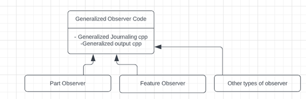
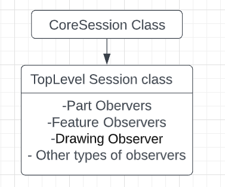

# Task 3 Documentation

1. To generalize the observer code, will introduce a general observer library which will contain the most required functions for any observer as journaling and output. With this library, we will be able to add any other type of observers.  

2. Relocating Part Observers library to a better location. And using the demand loaded library option to minimize compilation time. 
3. Will build a toplevel session that relies on Core Session that will be able to satisfy any observer needs. 

